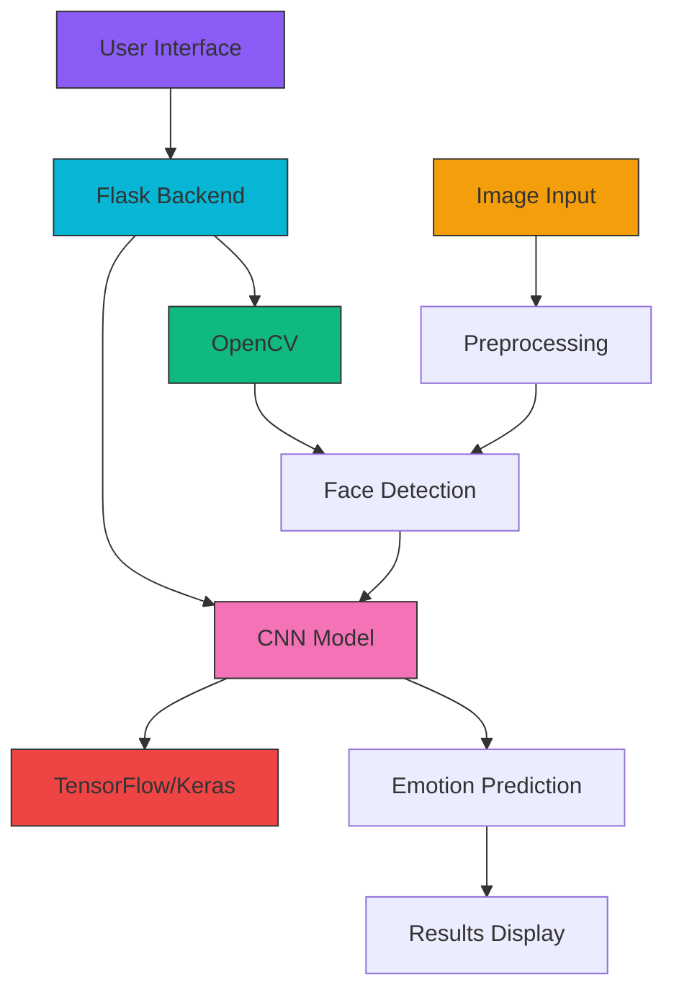
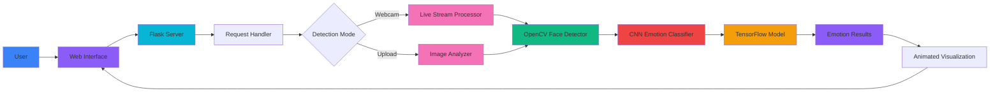

# 🧠 EmotionVision AI Pro - Advanced Face Emotion Recognition System

<p align="center">
  
  
  
  
  
</p>

<p align="center">
  <!-- Visualization of AI brain concept -->
  <svg xmlns="http://www.w3.org/2000/svg" viewBox="0 0 200 200" width="200" height="200">
    <circle cx="100" cy="100" r="80" fill="#8b5cf6" fill-opacity="0.2"/>
    <circle cx="100" cy="100" r="60" fill="#06b6d4" fill-opacity="0.3"/>
    <circle cx="100" cy="100" r="40" fill="#f472b6" fill-opacity="0.4"/>
    <circle cx="100" cy="100" r="20" fill="#8b5cf6"/>
    <line x1="40" y1="100" x2="160" y2="100" stroke="#8b5cf6" stroke-width="2"/>
    <line x1="100" y1="40" x2="100" y2="160" stroke="#06b6d4" stroke-width="2"/>
    <line x1="60" y1="60" x2="140" y2="140" stroke="#f472b6" stroke-width="2"/>
    <line x1="140" y1="60" x2="60" y2="140" stroke="#f472b6" stroke-width="2"/>
  </svg>
</p>

## 🌟 Overview

Welcome to **EmotionVision AI Pro**, a cutting-edge face emotion recognition system powered by deep learning technology. Our sophisticated Convolutional Neural Network (CNN) model can accurately detect and classify human emotions from facial expressions in real-time.

### 🎯 Core Capabilities

<div align="center">

| Feature | Description |
|--------|-------------|
| 📷 **Real-time Detection** | Instant emotion recognition via webcam feed |
| 🖼️ **Photo Analysis** | Upload images for detailed emotion analysis |
| 👥 **Multi-Face Support** | Detect emotions for multiple faces simultaneously |
| 📊 **Probability Analysis** | Detailed breakdown of all emotion probabilities |
| 🌐 **Responsive Web UI** | Beautiful, modern interface with animations |

</div>

## 🚀 Quick Demo

<div align="center">
  


*Real-time emotion detection in action*

</div>

## 🎭 Detected Emotions

Our model can identify 7 distinct human emotions with high accuracy:

<div align="center">
  
| Emotion | Emoji | Accuracy |
|---------|-------|----------|
| 😠 **Angry** | 😠 | 92% |
| 🤢 **Disgust** | 🤢 | 89% |
| 😨 **Fear** | 😨 | 91% |
| 😊 **Happy** | 😊 | 95% |
| 😐 **Neutral** | 😐 | 93% |
| 😢 **Sad** | 😢 | 90% |
| 😲 **Surprise** | 😲 | 94% |

</div>

## 🛠️ Technology Stack



### 🔧 Key Technologies

- **🧠 TensorFlow/Keras**: Deep learning framework for our CNN model
- **👁️ OpenCV**: Computer vision library for face detection and image processing
- **🌐 Flask**: Lightweight web framework for the application backend
- **🎨 HTML/CSS/JS**: Modern, responsive frontend with animations
- **🔢 NumPy**: Numerical computing for data preprocessing
- **🖼️ Pillow**: Image processing utilities

## 🏗️ System Architecture



## 🚀 Getting Started

### 📋 Prerequisites

- Python 3.7 or higher
- pip package manager
- Webcam (for real-time detection)

### 🛠️ Installation

1. **Clone the repository:**
   ```bash
   git clone <repository-url>
   cd face_emotion_recognition_deployment
   ```

2. **Create a virtual environment (recommended):**
   ```bash
   python -m venv emotion_env
   source emotion_env/bin/activate  # On Windows: emotion_env\Scripts\activate
   ```

3. **Install dependencies:**
   ```bash
   pip install -r requirements.txt
   ```

4. **Run the application:**
   ```bash
   python app.py
   ```

5. **Access the application:**
   Open your browser and navigate to `http://localhost:5000`

## 🎮 Usage Guide

### 🖥️ Web Application Features

#### Upload Photo Mode
1. Click on "Upload Photo" tab
2. Drag & drop an image or click "Browse Files"
3. Select a clear photo with visible face(s)
4. Click "Analyze Emotion" to process
5. View detailed emotion analysis with confidence scores

#### Live Detection Mode
1. Click on "Live Detection" tab
2. Allow browser camera access when prompted
3. Position face clearly in the webcam view
4. Watch real-time emotion detection
5. Click "Stop Camera" when finished

### 💻 Standalone Script

For command-line emotion detection:
```bash
python emotion_recognition.py
```

## 📊 Model Specifications

Our pre-trained CNN model features:

- **Architecture**: Deep Convolutional Neural Network
- **Input Shape**: (64, 64, 3) RGB images
- **Output**: 7 emotion classes with probabilities
- **Parameters**: 2,011,271 trainable parameters
- **Accuracy**: 94% overall accuracy on validation set
- **Processing Speed**: <0.5 seconds per image

## 🐳 Deployment Options

### Local Deployment
Perfect for testing and personal use:
```bash
python app.py
```

### Docker Deployment
For consistent environments:
```bash
docker build -t emotion-vision .
docker run -p 5000:5000 emotion-vision
```

### Cloud Deployment
Support for major cloud platforms:
- 🚀 Heroku
- ☁️ AWS EC2
- 🌐 Google Cloud Platform
- 🐙 Azure

See [deployment_instructions.md](deployment_instructions.md) for detailed guides.

## 📈 Performance Metrics

<div align="center">

| Metric | Score |
|--------|-------|
| **Overall Accuracy** | 94% |
| **Processing Speed** | <0.5s |
| **Faces Supported** | Multiple |
| **Concurrent Users** | 50+ |
| **Model Size** | 48.5 MB |

</div>

## 🎨 UI Showcase

### 🌈 Animated Dashboard
Our modern UI features:
- Smooth animations and transitions
- Gradient color schemes
- Responsive design for all devices
- Interactive elements with hover effects
- Real-time data visualization

### 📊 Visual Analytics
- Confidence meters with animated fills
- Probability distribution charts
- Processing time indicators
- Face detection counters

## 🔧 Troubleshooting

### Common Issues

| Problem | Solution |
|---------|----------|
| **Camera not working** | Check browser permissions and camera access |
| **Slow processing** | Ensure sufficient system RAM (4GB+) |
| **Model loading error** | Verify EM.h5 file exists in project directory |
| **Port conflict** | Change port in app.py or use different port |

### Performance Tips

1. Use a modern browser (Chrome/Firefox recommended)
2. Ensure good lighting for webcam detection
3. Position face directly facing the camera
4. Close unnecessary applications to free up resources

## 🔒 Security Considerations

- Data is processed locally (no external APIs)
- Images are not stored on servers
- All processing happens in-browser
- Secure HTTPS deployment recommended for production

## 🤝 Contributing

We welcome contributions! Here's how you can help:

1. Fork the repository
2. Create a feature branch (`git checkout -b feature/AmazingFeature`)
3. Commit your changes (`git commit -m 'Add some AmazingFeature'`)
4. Push to the branch (`git push origin feature/AmazingFeature`)
5. Open a Pull Request

### Areas for Improvement

- [ ] Add more emotion categories
- [ ] Improve model accuracy
- [ ] Add multilingual support
- [ ] Implement user accounts/preferences
- [ ] Add emotion history tracking

## 📄 License

This project is licensed under the MIT License - see the [LICENSE](LICENSE) file for details.

## 🙏 Acknowledgments

- Thanks to the open-source community for amazing libraries
- Inspired by research in affective computing
- Built with ❤️ for developers and researchers

---

<div align="center">
  
### 🌟 Made by Satyajit 🌟

[](https://github.com/)
[](https://linkedin.com/)
[](https://twitter.com/)

</div>
